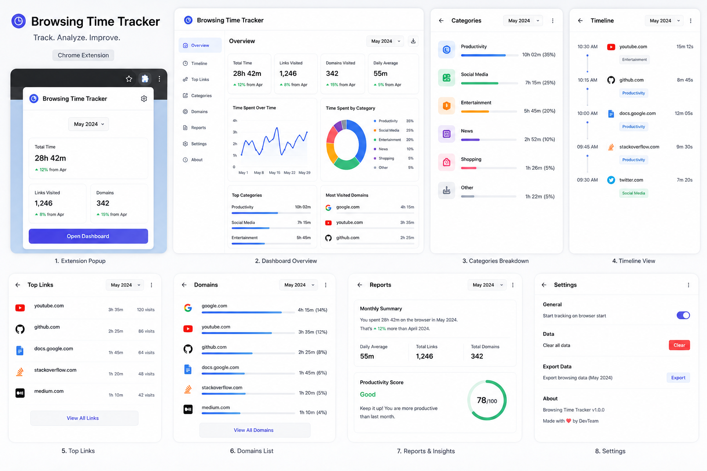

# 🕒 Browsing Time Tracker

A modern, high-performance, and privacy-centric Chrome Extension designed to track, categorize, and visualize your daily browser activity. Get real-time insights into your productivity, daily habits, and time distribution without ever sending your data to the cloud.

---

## 📸 Preview



---

## ✨ Features

- **⏱️ Real-Time Activity Tracking**: Tracks elapsed active time per domain and pauses automatically when you are idle (configurable idle threshold) or when the browser loses focus.
- **📊 Interactive Dashboard**: Visualizes your daily and monthly browsing history with rich, interactive charts powered by **Chart.js**.
- **📂 Automatic Categorization**: Automatically categorizes websites (e.g., *Productivity*, *Social Media*, *Entertainment*, *News*, *Shopping*, and *Other*) based on domain rules.
- **📈 Productivity Scoring**: Calculates a dynamic daily/monthly productivity score based on your active categories to help keep you focused.
- **🔍 Timeline Activity View**: A detailed chronological journal of your browsing activities with duration logs, site icons, and page titles.
- **📥 Export & Data Portability**: Export your browsing history as clean JSON or CSV files anytime.
- **🔒 Privacy First & 100% Local**: No external analytics SDKs, trackers, or API endpoints. All data is kept securely on your machine using the Chrome Local Storage API.

---

## 🚀 Installation & Getting Started

Since this extension is in developer mode, follow these steps to load it into Google Chrome:

1. **Download/Clone the Repository**:
   Download the zip file and extract it, or clone the repository to your local directory:
   ```bash
   git clone https://github.com/snehith993/Browsing-time-traker.git
   ```
2. **Open Extensions Page**:
   Open Chrome and navigate to `chrome://extensions/` by typing it in the address bar.
3. **Enable Developer Mode**:
   Toggle the **Developer mode** switch in the top-right corner of the page.
4. **Load Unpacked Extension**:
   - Click the **Load unpacked** button in the top-left corner.
   - Select the root folder of the project (containing `manifest.json`).
5. **Pin & Use**:
   - Click on the extension puzzle icon in your Chrome toolbar.
   - Pin **Browsing Time Tracker** for quick access.
   - Click the extension icon to view today's quick summary or click the button to open the full dashboard!

---

## 🛠️ Tech Stack & Dependencies

| Technology | Purpose |
| :--- | :--- |
| **JavaScript (ES6+)** | Core extension logic & tracking engine |
| **HTML5 & CSS3** | Custom-designed popup and dashboard interfaces |
| **Chrome Extension APIs** | Low-level browser events monitoring (Tabs, Storage, Alarms, Idle) |
| **Chart.js (v4.x)** | Dynamic dashboard charts & analytics visualizers |
| **Manifest V3** | Modern chrome extension permission model & lifecycle management |

---

## 📂 Project Structure

```text
Browsing-time-traker/
├── manifest.json              # Extension metadata and Manifest V3 permissions
├── PRIVACY.md                 # Details on data storage and user permissions
├── Readme.md                  # Project documentation and guide
├── browser_extension.png      # Screenshot showcase of the dashboard UI
├── icons/                     # Extension branding and UI icons
│   ├── icon16.png
│   ├── icon32.png
│   ├── icon48.png
│   └── icon128.png
└── src/                       # Source files
    ├── background.js          # Service worker monitoring tabs and idle thresholds
    ├── shared.js              # Utilities, default configuration state, categorization logic
    ├── popup.html             # UI for the Chrome toolbar extension popup
    ├── popup.js               # Logic for toolbar popup interaction and today's top list
    ├── dashboard.html         # Rich analytics dashboard interface
    ├── dashboard.js           # Analytics logic, Chart.js integrations, settings management
    ├── styles.css             # Main styling system for the dashboard and popup
    └── chart.umd.min.js       # Precompiled local bundle of Chart.js
```

---

## ⚙️ Architecture & Logic Flow

```text
                 ┌─────────────────────────┐
                 │   Chrome Extension UI   │
                 │ Popup + Dashboard       │
                 └──────────┬──────────────┘
                            │
                     Chrome APIs
                            │
         ┌───────────────────┴───────────────────┐
         │                                       │
 ┌───────▼────────┐                  ┌───────────▼──────────┐
 │ Background JS  │                  │ Content Scripts      │
 │ Time Tracking  │                  │ URL Detection        │
 └───────┬────────┘                  └───────────┬──────────┘
         │                                       │
         └───────────────────┬───────────────────┘
                             │
                     Local Storage API
                             │
                  ┌──────────▼──────────┐
                  │ Analytics Engine    │
                  │ Categorization      │
                  └──────────┬──────────┘
                             │
                  ┌──────────▼──────────┐
                  │ Dashboard Reports   │
                  │ Charts & Insights   │
                  └─────────────────────┘
```

### 🧠 How It Works Behind the Scenes

1. **Background Service Worker (`src/background.js`)**:
   - Listens to active tab events (`chrome.tabs.onActivated`, `chrome.tabs.onUpdated`).
   - Hooks into the browser window focus states (`chrome.windows.onFocusChanged`) and idle states (`chrome.idle.onStateChanged`) to pause tracking if the user is away.
   - Enqueues updates to prevent race conditions during heavy tab-switching activity.

2. **Categorization Engine (`src/shared.js`)**:
   - Parses the active domain and runs a pattern matching algorithm against configured categories:
     - **Productivity**: `github.com`, `stackoverflow.com`, `notion.so`, `figma.com`, etc.
     - **Social Media**: `twitter.com`, `linkedin.com`, `reddit.com`, `facebook.com`, etc.
     - **Entertainment**: `youtube.com`, `netflix.com`, `spotify.com`, etc.
     - **News**: `bbc.com`, `nytimes.com`, etc.
     - **Shopping**: `amazon.com`, `flipkart.com`, `etsy.com`, etc.

3. **Data Management & Retention**:
   - All events are consolidated into days inside a single state object.
   - Automatically handles data retention (defaults to keeping the last 180 days of activity) to avoid storage bloat.

---

## 🔒 Privacy & Permissions

Your privacy is the highest priority. All data collected by the extension is stored on your local disk using `chrome.storage.local`. The extension requests the following permissions:

* `tabs`: Required to retrieve the URL and title of the active tab being browsed.
* `storage`: Required to save history statistics and your tracking preferences.
* `alarms`: Required to perform heartbeat checks for elapsed active time.
* `idle`: Required to pause tracking when the browser is idle or lock screen is active.
* `favicon`: Used to display site favicons inside the dashboard list and popup UI.

For more details, check out [PRIVACY.md](PRIVACY.md).

---

## 📄 License

This project is open-source and available under the MIT License.
